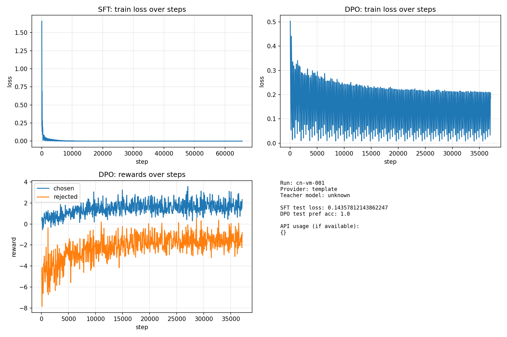
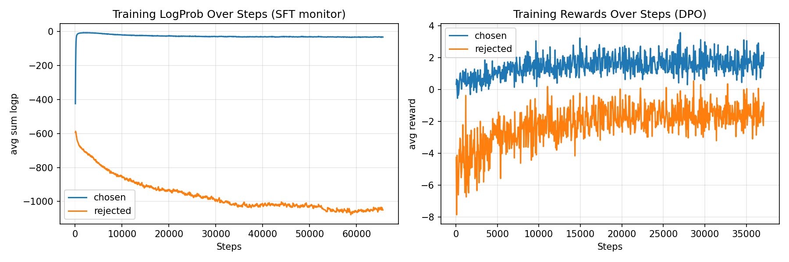
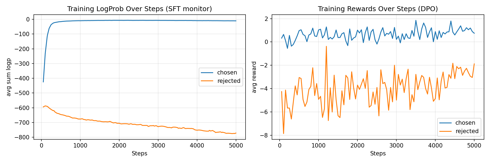
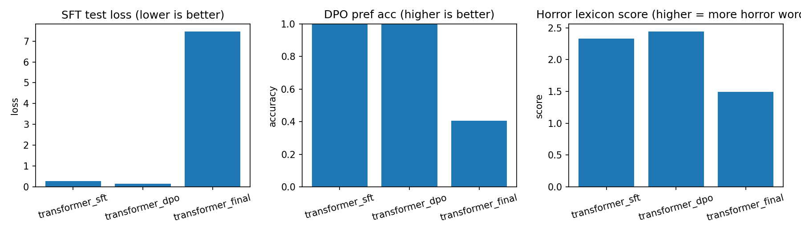
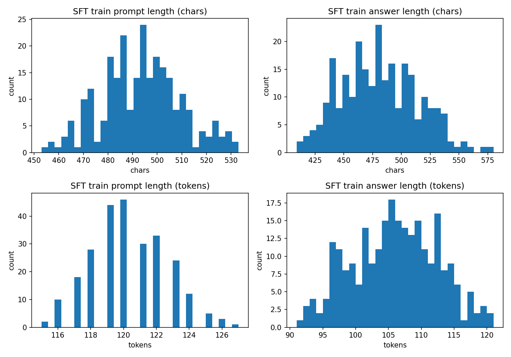

# Part2 Bundle Index / Part2 整理包索引

Run tag / 运行标签: `cn-vm-001`

## Figures / 图表

- `figures/summary.png`
- `figures/curves_updated.png`
- `figures/curves_first_5000.png` (early steps view)
- `figures/checkpoint_bars.png`
- `figures/dataset_lengths.png`

### Summary / 总览

### Training curves / 训练曲线

### Training curves (early steps) / 训练曲线（前期放大）

### Checkpoint comparison / Checkpoint 对比

### Dataset lengths / 数据长度分布

## Tables / 表格

- `tables/checkpoint_metrics.md`
- `tables/checkpoint_metrics.csv`
- `tables/dataset_stats.json`

## Samples / 示例生成

- `samples/generations.md`

## Reports / 报告

- `REPORT_ZH_EN.md`
- `DIAGRAM.md`
