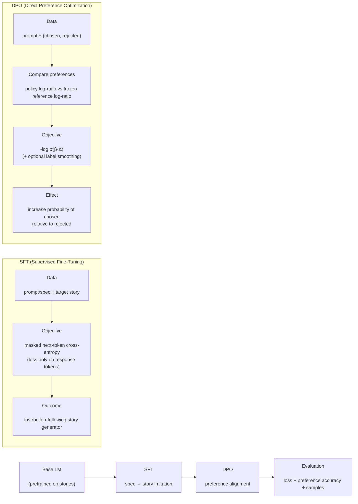

# Part2 Results Bundle / Part2 结果整理包

**Run tag / 运行标签**: `cn-vm-001`
**Source run dir / 来源目录**: `/Users/zhaozhongliu/Library/Mobile Documents/com~apple~CloudDocs/NYU/ML/pico-llm-正式版/pico-llm/part2/runs/cn-vm-001`

## 1) What is this? / 这是什么？

- EN: This folder packages the most important *figures + metrics + sample generations* from a completed Part2 run, so you can directly use them for a poster/report.
- 中文：本文件夹把 Part2 一次跑完的关键产出（图、指标、示例生成）集中整理，方便直接用于 poster/报告。

## 2) Pipeline diagram / 流程图



## 3) Data & teacher LLM / 数据与教师模型

- EN: Dataset provider = `template`, teacher model = `n/a`
- 中文：数据生成方式 = `template`，教师模型 = `n/a`

### Dataset quick stats / 数据概览

```json
{
  "n_rows": 256,
  "prompt_chars": {
    "min": 453.0,
    "p50": 493.0,
    "p90": 513.0,
    "max": 533.0,
    "mean": 493.4296875
  },
  "answer_chars": {
    "min": 409.0,
    "p50": 481.0,
    "p90": 527.0,
    "max": 580.0,
    "mean": 480.84765625
  },
  "prompt_tokens": {
    "min": 115.0,
    "p50": 120.0,
    "p90": 123.0,
    "max": 127.0,
    "mean": 120.2421875
  },
  "answer_tokens": {
    "min": 91.0,
    "p50": 106.0,
    "p90": 114.0,
    "max": 121.0,
    "mean": 105.46875
  }
}
```

## 4) Metrics by checkpoint / 各 checkpoint 指标对比

- EN: `sft_test_loss` uses the SFT test split (next-token loss with a mask). `dpo_test_pref_acc` is preference accuracy on the DPO test split.
- 中文：`sft_test_loss` 为 SFT test 集上的掩码 next-token loss；`dpo_test_pref_acc` 为 DPO test 集上的偏好准确率。

- See table: `tables/checkpoint_metrics.md`
- See figure: `figures/checkpoint_bars.png`

## 5) Samples / 示例生成

- EN: See `samples/generations.md` (same prompts across checkpoints).
- 中文：见 `samples/generations.md`（同一批 prompt 在不同 checkpoint 下的生成对比）。

## 6) Files in this bundle / 文件说明

- `figures/`: poster-ready PNG figures
- `tables/`: compact metric tables (CSV/Markdown)
- `samples/`: side-by-side generations for qualitative comparison
- `run_snapshot/`: copied JSON/JSONL from the original run for reproducibility

## 7) Reproduce / 复现

- EN: Re-run the full pipeline with `pico-llm/part2/run_all.sh` (see `pico-llm/part2/docs/RUN_ALL_USAGE.md`).
- 中文：完整复现可用 `pico-llm/part2/run_all.sh`（参考 `pico-llm/part2/docs/RUN_ALL_USAGE.md`）。

Generated at: `2025-12-15 21:53:09`
